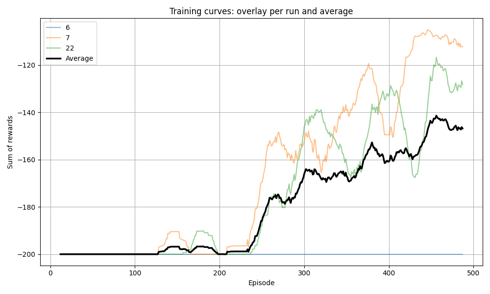
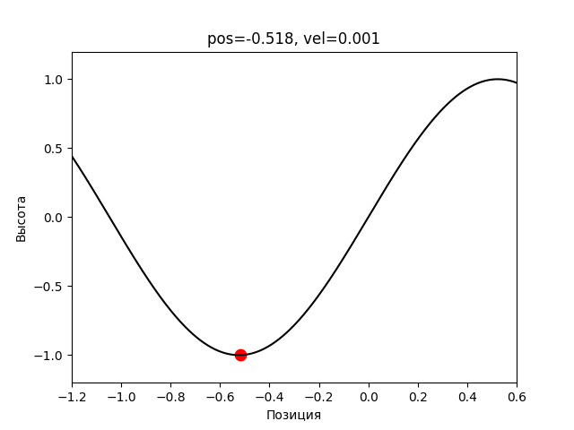

# MountainCar: DQN and Q-Learning

A reinforcement-learning lab built around the classic MountainCar control
problem. It compares a PyTorch Deep Q-Network with a tabular Q-learning
baseline and includes a configurable reimplementation of the environment for
experiments with terrain and physics.

## What is implemented

- replay-buffer DQN with an epsilon-greedy policy;
- target-network updates and Huber loss;
- configurable network size, learning rate, discount, replay capacity, and
  epsilon schedule;
- custom position, velocity, force, gravity, hill frequency, and hill amplitude;
- tabular Q-learning baseline with discretized state space;
- repeatable seeded runs, CSV metrics, plots, evaluation, and GIF rendering.

## Files

- `dqn_experiment.py` — full experiment using the configurable local
  MountainCar environment.
- `classic_dqn_experiment.py` — DQN against Gymnasium's standard
  `MountainCar-v0`.
- `q_learning_baseline.py` — tabular baseline for comparison.
- `metrics_aggregated.csv` — representative aggregated training metrics.
- `training_curve.png` and `demo.gif` — selected experiment artifacts.

## Run

From the repository root, train the configurable DQN and save fresh artifacts:

```bash
python3 mountaincar-dqn/dqn_experiment.py \
  --episodes 500 --eval_episodes 20 --seed 42 \
  --render_demo --gif_path mountaincar-dqn/run_demo.gif \
  --plot_path mountaincar-dqn/run_curve.png
```

Run the same algorithm against the canonical Gymnasium environment:

```bash
python3 mountaincar-dqn/classic_dqn_experiment.py \
  --episodes 500 --eval_episodes 20 --device auto
```

Train the tabular baseline:

```bash
python3 mountaincar-dqn/q_learning_baseline.py \
  --episodes 500 --eval_episodes 20 --num_bins 30
```

Use `--help` on any script to see the complete experiment controls.

## Representative results





The checked-in outputs document one experiment series; they are not a formal
benchmark across reinforcement-learning libraries or hardware.
